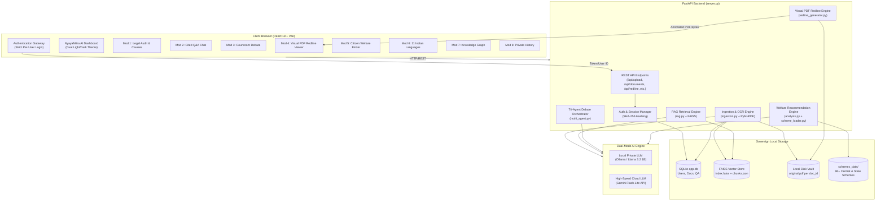

# ⚖️ NyayaMitra AI — Comprehensive Project Architecture & Technical Implementation Guide

> **Sovereign Legal Contract Intelligence & Citizen Welfare Platform**  
> *Official GovTech Engineering Architecture Specification*

---

## 1. Executive Summary & Problem Statement

### 1.1 The Problem
1. **Asymmetric Contract Risk**: Government procurement tenders, employment agreements, commercial leases, and MSME vendor agreements in India are filled with dense legalese, unilateral termination clauses, one-sided indemnity traps, and aggressive liability conditions. Non-legal professionals, contractors, and public servants often sign without realizing these hazards.
2. **Citizen Welfare Gap**: India runs hundreds of Central and State welfare initiatives (such as PM-KISAN, Ayushman Bharat, PMAY, Mudra loans, and student scholarships), yet millions of eligible beneficiaries miss out due to a lack of awareness, complex eligibility criteria, and bureaucratic hurdles.
3. **Linguistic Divide**: Statutory legal contracts and scheme guidelines are overwhelmingly published in complex English or formal Hindi, excluding non-English speakers across India's 22 scheduled languages.
4. **Data Sovereignty & Air-Gap Privacy**: Uploading sensitive state government contracts or private citizen demographics to commercial third-party cloud AI tools poses severe privacy, DPDP Act compliance, and national data sovereignty concerns.

### 1.2 The Solution: NyayaMitra AI
**NyayaMitra AI** is a dual-engine GovTech platform designed to solve both challenges in a unified, sovereign interface:
* **Legal Contract Risk Scrutiny & Visual PDF Redlining**: Automatically parses PDF contracts, detects dangerous clauses, and draws literal vector-grade red strikethrough lines and caution badges directly onto the uploaded PDF.
* **Citizen Welfare Scheme Recommender**: Takes a citizen's basic demographic profile (Age, Gender, Occupation, Income, State, Social Category, Land ownership) and uses a multi-stage filtering and AI reasoning pipeline to match them against 96+ welfare schemes.
* **Sovereign Dual-AI Architecture**: Operates 100% locally on private, air-gapped models (Ollama/Llama 3.2 1B) with zero cloud leaks, or in high-speed cloud mode (Gemini Flash-Lite) for high-throughput public use.

---

## 2. Complete Technology Stack

| Layer | Technology | Version | Purpose & Rationale |
|---|---|---|---|
| **Frontend Framework** | **React.js** | `18.3.1` | Component-based, highly responsive single-page application. |
| **Build Tool & Bundler** | **Vite** | `8.3.3` | Ultra-fast Hot Module Replacement (HMR) and optimized ES module bundling. |
| **Styling & Design System** | **Tailwind CSS** | `4.0` | Custom Government Portal theme (National Navy `#0f3d68`, Saffron `#ea580c`, Emerald `#138808`), fully contrast-optimized for Bright & Dark modes. |
| **Icons & Visuals** | **Lucide React** | `^1.16.0` | High-clarity SVG icon library for official gov-tech UI. |
| **Backend API Server** | **FastAPI** | `^0.115.0` | High-performance asynchronous Python REST API framework with automatic OpenAPI documentation. |
| **ASGI Server** | **Uvicorn** | `^0.30.0` | Production-grade ASGI server running asynchronous Python backend tasks. |
| **Database & ORM** | **SQLite + SQLAlchemy** | `^2.0.0` | Serverless, relational database storing user authentication, document metadata, audit history, and Q&A transcripts with complete user isolation. |
| **PDF Processing & Markup** | **PyMuPDF (`fitz`)** | `1.28.2` | High-performance C-based PDF text extraction, word coordinate mapping, and vector-level redline strikethrough drawing. |
| **OCR Engine** | **Tesseract OCR / pytesseract** | `^5.0` | Optical Character Recognition for scanned image-only PDF tenders. |
| **Embeddings Model** | **SentenceTransformers** | `all-MiniLM-L6-v2` | Dense 384-dimensional vector embeddings running locally on CPU. |
| **Vector Database** | **FAISS (CPU)** | `^1.9.0` | Facebook AI Similarity Search for sub-millisecond similarity search across contract chunks. |
| **Local LLM Engine** | **Ollama / Llama 3.2 1B** | `3.2` | 100% sovereign, air-gapped on-device AI inference with zero external network calls. |
| **High-Speed Cloud LLM** | **Google Gemini Flash-Lite** | `gemini-3.5-flash-lite` | Optional high-throughput inference engine for fast response times. |
| **Document Generation** | **ReportLab & python-docx** | Latest | Official PDF inspection report generation and document synthesis. |

---

## 3. High-Level Architecture Diagram



---

## 4. End-to-End Implementation Details

### 4.1 Document Ingestion & OCR Pipeline (`ingestion.py`)
1. **Scanned PDF Detection**: Inspects character density. If total extractable text across all pages is under 100 characters, flags the document as scanned.
2. **Dual-Extraction**:
   * *Native PDFs*: Directly extracts text and page numbers via `page.get_text()` using PyMuPDF.
   * *Scanned PDFs*: Converts each page to high-DPI pixmaps and routes them through `pytesseract.image_to_string()`.
3. **Smart Chunking**: Text is recursively divided into ~400-token chunks with 50-token overlaps, preserving semantic boundaries and page numbers.
4. **Vector Embedding & Indexing**: Generates dense 384-dimensional embeddings using `sentence-transformers/all-MiniLM-L6-v2` and indexes them in an `IndexFlatL2` FAISS database stored at `vector_store/{doc_id}/index.faiss`.
5. **Vault Storage**: The original uploaded PDF is permanently saved at `vector_store/{doc_id}/original.pdf` for subsequent visual redline rendering.

---

### 4.2 Module 1: Comprehensive Legal Document Audit (`analysis.py`)
* **Unified Single-Pass AI Analysis**: To eliminate latency, a single structured prompt instructs the LLM to extract:
  * Executive Summary (2-3 paragraphs in plain business English)
  * Classified Clauses (Type, Title, Text, Severity)
  * Risky Clauses Matrix (Risk Level: High/Medium/Low, Category, Exact Excerpt, Why Risky, Suggested Statutory Replacement)
  * Named Entities (Parties, Dates, Penalties, Governing Jurisdiction)
* **Output Sanitation**: Uses `_safe_parse_json()` with regex markdown fence extractors to ensure 100% valid JSON parsing even if the LLM produces extra conversational commentary.

---

### 4.3 Module 2: Interactive Contract Q&A with Page Citations (`rag.py`)
* **Semantic Query Encoding**: The user's question is encoded with `SentenceTransformer`.
* **FAISS Vector Search**: Queries top-k (k=3) nearest chunk vectors via L2 distance.
* **Context Assembly & Grounded Prompt**: Relevant chunks are formatted with explicit `[Page X]` headers, instructing the LLM:
  > *"Answer strictly using the provided context. If the answer cannot be determined from the context, state so. Always cite the exact page number."*
* **Response & Citation Extraction**: Matches cited page references and saves the dialogue into `qa_history` in `app.db`.

---

### 4.4 Module 3: Multi-Agent Courtroom Legal Debate (`multi_agent.py`)
Simulates a real-world judicial trial over the contract's high-risk terms using 3 adversarial AI roles:
1. **Agent 1 (The Critic)**: Scrutinizes every ambiguity, unilateral right, indemnity trap, and harsh penalty clause to present the most aggressive legal attack.
2. **Agent 2 (The Defender)**: Argues the counter-perspective, explaining why clauses represent standard commercial practice, necessary risk mitigation, or bilateral compromise.
3. **Agent 3 (The Judge)**: Evaluates both arguments objectively under Indian statutory law (e.g., Indian Contract Act 1872) and delivers a balanced, final legal verdict with actionable recommendations.
* **Orchestration**: Implemented in a unified multi-agent prompt flow that guarantees coherent cross-examination and structured JSON output for the interactive frontend debate UI.

---

### 4.5 Module 4: Direct Visual PDF Contract Redlining (`redline_generator.py`)
Unlike traditional systems that output plain text or Word `.docx` suggestions, NyayaMitra AI modifies the **actual PDF bytes**:
1. **Multi-Stage Text Locator (`find_clause_rects_on_page`)**:
   * *Stage 1*: Exact phrase search via `page.search_for()`.
   * *Stage 2*: 5-word sliding sub-phrase search for handling line breaks and punctuation shifts.
   * *Stage 3*: Word-sequence alignment using normalized word coordinates from `page.get_text("words")`, grouping matched words per line into tight bounding boxes `fitz.Rect(x0, y0, x1, y1)`.
2. **Vector Graphics Markup**:
   * **Strikethrough Line**: `page.draw_line(Point(x0, y_mid), Point(x1, y_mid), color=(0.85, 0.05, 0.05), width=2.2)` directly across the center of the risky text.
   * **Highlight Bounding Box**: `page.draw_rect(r, color=red, fill=(1.0, 0.88, 0.88), fill_opacity=0.35, width=0.8)` providing visual callout.
   * **Warning Tag Badge**: Draws a solid red rectangle above the first line with white text: `⚠ HIGH RISK · TERMINATION`.
   * **Acrobat / Reader Annotation**: Injects standard PDF strikeout annotations (`page.add_strikeout_annot(r)`) containing hover notes with the legal risk assessment and replacement recommendation.
3. **Live Interactive Viewing & Export**:
   * Inline streaming via `@app.get("/api/redline/pdf/{doc_id}")` rendered in an embedded iframe.
   * Attachment download via `@app.get("/api/redline/download-pdf/{doc_id}")`.

---

### 4.6 Module 5: Citizen Welfare Scheme Recommender (`scheme_loader.py` & `analysis.py`)
1. **Database of 96+ Schemes**: Categorized into Agriculture, Healthcare, Education, Housing, Social Welfare, Employment, Women & Child Development, Minority Welfare, Disability Welfare, and Senior Citizens.
2. **Demographic Intake Profile**:
   * Gender (Female, Male, Other)
   * Age (1 - 120)
   * Occupation (Farmer, Student, Self-Employed, Daily Wage Worker, Salaried, Homemaker, Unemployed, Senior Citizen)
   * Annual Household Income (INR)
   * State / Union Territory (All India / Central or specific State)
   * Social Category (General, OBC, SC, ST, EWS, Minority)
   * Special Conditions (Land Ownership, BPL Card, Pregnant/Lactating, PwD, Kutcha House, Startup Loan, Higher Education)
3. **2-Stage Hybrid Matching Engine**:
   * *Stage 1 (Algorithmic Pre-Filtering)*: Filters schemes based on deterministic rules (Age brackets, income ceilings, state eligibility, and category prerequisites).
   * *Stage 2 (Semantic AI Scoring & Reasoning)*: The top candidate schemes are evaluated by the LLM to calculate match scores (0-100%), entitlement summaries, key benefits, and step-by-step application instructions.

---

### 4.7 Module 6: Multilingual Inclusion (`multilingual.py`)
* **11 Official Indian Languages**: Hindi, Marathi, Tamil, Telugu, Bengali, Gujarati, Kannada, Malayalam, Punjabi, Urdu, English.
* **Direct Legal Summarization**: Translates complex contracts into simple, culturally accessible plain-language summaries (max 200 words) so rural citizens and local contractors understand their legal commitments.

---

### 4.8 Module 7: Interactive Knowledge Graph (`knowledge_graph.py`)
* Extracts entities (`Person`, `Organization`, `Date`, `Amount`, `Clause`, `Obligation`) and relationships (`must pay`, `terminates on`, `governed by`, `indemnifies`).
* Visualized as a force-directed network graph highlighting contract dependencies and critical liabilities.

---

### 4.9 Security, Authentication & Complete History Isolation
1. **Access Gate**: When unauthenticated (`!user`), the entire application workspace is locked behind the **NyayaMitra AI Authentication Gateway**.
2. **Password Security**: Passwords are cryptographically salted and hashed using SHA-256 (`database.hash_password()`).
3. **Strict User History Segregation**:
   * `/api/upload` requires `user_id` and records ownership in `documents.user_id`.
   * `/api/documents?user_id={id}` queries strictly by `filter_by(user_id=user_id)` without fallback. User A can never see User B's documents or chat transcripts.
   * Logging out resets all React state, document caches, and chat messages, immediately re-locking the platform.

---

## 5. File-by-File Codebase Map

```
ai-contract-analyzer/
├── server.py                 # FastAPI REST API (Auth, Upload, Redline, Chat, Schemes)
├── database.py               # SQLAlchemy models (User, Document, QAHistory)
├── ingestion.py              # PDF extraction, OCR, recursive chunking & FAISS indexer
├── analysis.py               # Unified AI analysis (Summary, Clauses, Risks, Entities, Schemes)
├── redline_generator.py      # PyMuPDF vector redline strikethroughs & highlight markup
├── rag.py                    # FAISS similarity retrieval & cited conversational Q&A
├── multi_agent.py            # Tri-Agent legal debate (Critic, Defender, Judge)
├── scheme_loader.py          # 96+ Indian welfare schemes loader & demographic filtering
├── schemes_data/             # JSON repository of all 96+ welfare schemes
│   └── all_schemes.json
├── multilingual.py           # Translation & plain-language summaries across 11 languages
├── knowledge_graph.py        # Entity-relationship extraction & graph generation
├── report_generator.py       # ReportLab PDF audit report generator
├── config.py                 # Central environment configuration (.env loader)
├── .env.example              # Template environment configuration
├── .gitignore                # Production git exclusion (protects secrets, DB, node_modules)
└── frontend/                 # React 18 + Vite frontend
    ├── index.html            # Application entry HTML with NyayaMitra AI branding
    ├── package.json          # Frontend npm scripts & dependencies
    ├── vite.config.js        # Vite configuration (port 5173, reverse proxy to :8000)
    ├── public/
    │   ├── hero_scheme.jpg   # Option 1: Clean & Bright 3D Welfare Tablet (Light Mode)
    │   └── hero_scheme_dark.jpg # Option 2: Glowing Dark Glass Tablet (Dark Mode)
    └── src/
        ├── App.jsx           # Master UI: Auth Gate, Modules 1-8, Theme Switcher
        ├── App.css           # Custom animations and scrollbar styles
        └── index.css         # Tailwind CSS directives and GovTech color definitions
```

---

## 6. How to Run the Platform

### Step 1: Start the FastAPI Backend
```powershell
cd C:\Users\Admin\.gemini\antigravity\scratch\ai-contract-analyzer
.\venv\Scripts\uvicorn.exe server:app --host 0.0.0.0 --port 8000
```

### Step 2: Start the React Frontend
```powershell
cd C:\Users\Admin\.gemini\antigravity\scratch\ai-contract-analyzer\frontend
npm run dev -- --host --port 5173
```

### Step 3: Open in Browser
Navigate to **`http://localhost:5173`**:
1. Sign in through the **NyayaMitra AI Authentication Gateway** (or use quick test accounts).
2. Upload any contract PDF in **Module 1** for instant audit, risk classification, and entity extraction.
3. Scroll down to **Module 4** to view and download your **Redlined PDF with visual strikethrough lines on risky clauses**.
4. Explore **Module 5** to test the **Citizen Welfare Scheme Recommender** using custom demographic inputs or 1-click citizen presets.
